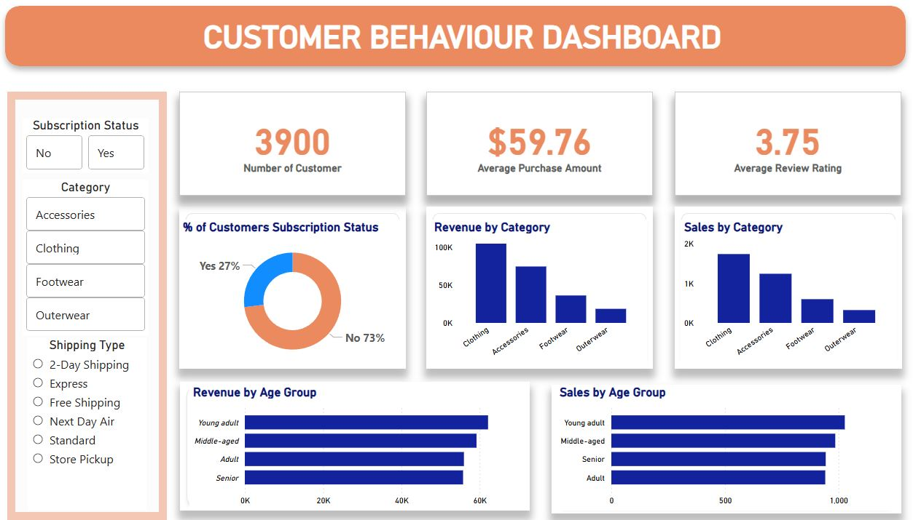

<div style="background-color:white; color:black; padding:24px; font-family:Segoe UI, Arial, sans-serif;">

<h2 style="color:#1f4fd8;">Business Problem Statement</h2>

<p>
A leading retail company seeks to gain deeper insight into its customers’ shopping behaviour in order to improve 
<strong>sales performance</strong>, <strong>customer satisfaction</strong>, and build 
<strong>long-term customer loyalty</strong>.
</p>

<p>
The management team has observed noticeable changes in purchasing patterns across:
</p>

<ul>
<li><strong>Customer demographics</strong></li>
<li><strong>Product categories</strong></li>
<li><strong>Sales channels</strong> (online vs. offline)</li>
</ul>

<p>
They are particularly interested in identifying the key factors that influence consumer decisions and repeat purchases, including:
</p>

<ul>
<li>Discounts</li>
<li>Reviews</li>
<li>Seasons</li>
<li>Payment preferences</li>
</ul>

<hr style="border:1px solid #1f4fd8;">

<h3 style="color:#1f4fd8;">
Task: Analysing the company’s consumer behaviour dataset to answer the following overarching business question
</h3>

<blockquote style="background-color:white; border-left:4px solid #1f4fd8; padding:12px; color:black;">
“How can the company leverage consumer shopping data to identify trends, improve customer engagement, and optimise marketing and product strategies?”
</blockquote>

<hr style="border:1px solid #1f4fd8;">

<h2 style="color:#1f4fd8;">Project Deliverables</h2>

<ol>

<li>
<strong>Data Preparation & Modelling (Python)</strong><br>
Clean, preprocess, and transform the raw consumer dataset to ensure accuracy and readiness for analysis.
</li>

<br>

<li>
<strong>Data Analysis (SQL)</strong><br>
Structure the data, simulate business transactions, and execute analytical queries to uncover insights on customer segments, loyalty patterns, and key purchase drivers.
</li>

<br>

<li>
<strong>Visualisation & Insights (Power BI)</strong><br>
Develop an interactive dashboard that highlights key trends and behavioural patterns, enabling stakeholders to make data-driven decisions.
</li>

<br>

<li>
<strong>Report & Presentation</strong><br>
Prepare a comprehensive project report that visually communicates insights and actionable recommendations to stakeholders.
</li>

</ol>

<hr style="border:1px solid #1f4fd8;">

<h2 style="color:#1f4fd8;">Tools Used</h2>
<div>
  <ol>
    <li>Python</li>
    <li>PostgreSQL</li>
    <li>Power BI</li>
  </ol>
</div>

<h2 style="color:#1f4fd8;">Project Setup Guide</h2>
<p>Follow the steps below to run the project end-to-end.</p>

  <h3>Clone the Repository</h3>
  
  ```bash
git clone https://github.com/comrade70/Shopping_Behaviour_Analysis_Using_Python_SQL_PowerBI.git
cd Shopping_Behaviour_Analysis_Using_Python_SQL_PowerBI
```
  <h3>Open the Customer_Shopping_Behaviour_Analysis.ipynb notebook</h3>
  <p>Run all cells sequentially to:</p>
  <div>
    <ol>
      <li>Load dataset</li>
      <li>Clean data</li>
      <li>Perform feature engineering</li>
      <li>Export data to PostgreSQL database</li>
    </ol>
  </div>
 
  <h3>Open database_queries.sql</h3>
  <p>Run SQL queries to answer the business questions, including: </p>
  <div>
      <ol>
        <li>What is the  total revenue generated by Male vs. Female?</li>
        <li>Which are the top 5 products with the highest review rating?</li>
        <li>Which customer used a discount but still spent more than the average amount?</li>
        <li>Compare the average purchase amount between standard and express shipping</li>
        <li>What is the revenue contribution of each age group?</li>
        <li>What are the top 3 most purchased products within each category?</li>
      </ol>
    </div>
    
  <h3>Connect the PostgreSQL Database to Power BI</h3>
  <p>Open the Customer_behaviour_dashboard.pbix dashboard and explore</p>



</div>
